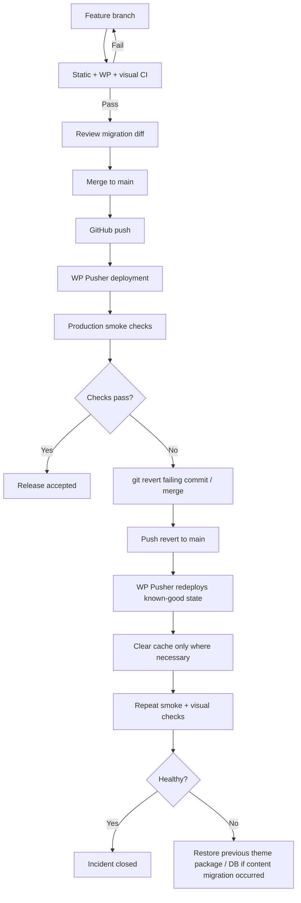

# KNDSB Child-Theme Architecture Research Report

## Executive summary

The KNDSB child theme does **not** need a ground-up rewrite. Its strongest architectural decision is already in place: Gutenberg blocks live under `/blocks/`, use a `kndsb/` namespace, and mostly keep their JavaScript and CSS together. The repository’s own design-system document already states the right principle: Client-First-style primitives own page layout, BEM components own their internal presentation, patterns compose rather than style, and reusable block CSS should live with the block. fileciteturn14file0L2-L2

The problem is that the repository has evolved faster than those rules have been enforced. The supplied ZIP contains **192 regular files**, including **29 Gutenberg block directories and 49 CSS files**. The current GitHub `main` is slightly newer than that ZIP and contains additional migration/duplicate artefacts, including parallel header/footer CSS, a second legacy stylesheet, template CSS under two different folder schemes, and several `.DS_Store` files. The connected `main` tree at the time of this audit is commit `fa785aef60dedb5f2e3e0188924b4b30923a5462`. fileciteturn1file0L2-L2

The main issue is therefore **ownership**, not merely file count. Current `inc/assets.php` enqueues a chain of **24 non-block front-end stylesheets** including homepage, sport-page, team-page, board, news, article and component styles, even when the current request does not need all of them. Meanwhile, 23 block-local `style.css` files are correctly declared through `block.json`; WordPress can optimise those based on whether the registered block is actually present. fileciteturn3file0L2-L2 citeturn7search7

There are two particularly important structural inconsistencies. First, six blocks have **no local stylesheet** despite rendering dedicated `kndsb-*` component markup: the five board-related blocks and `page-intro`. Their styling is instead owned by `template-parts/organisation/board.css` and `styles/components/page-intro.css`. Second, four important dynamic blocks—`featured-grid`, `news-row`, `posts-grid`, and `team-featured`—keep their server rendering inside the large `inc/blocks.php` rather than inside their own block directory. fileciteturn1file0L2-L2 fileciteturn5file0L2-L2

The recommended target is therefore a **block-first, deploy-ready classic child-theme architecture**:

- `/blocks/<slug>/` becomes the complete source of truth for each custom Gutenberg block: metadata, editor JavaScript, block CSS, front-end JavaScript and dynamic PHP rendering.
- `/assets/` contains **only genuinely global** CSS, JavaScript and images.
- `/components/` contains reusable PHP rendering fragments that are not Gutenberg blocks.
- `/template-parts/` contains markup fragments, **not CSS**.
- `/page-templates/` contains reusable classic page templates; specialised files such as `page-nieuws.php` remain in the root because that is how the classic WordPress template hierarchy works. citeturn7search5
- `theme.json` becomes the authoritative source for palette, content widths, typography presets, spacing presets and core element/block defaults. WordPress supports `theme.json` in classic themes as well as block themes. citeturn9search6turn10search6
- Newspaper/TagDiv/WPBakery compatibility gets isolated under `/assets/css/legacy/` and conditionally loaded only where legacy content is detected.
- `functions.php` remains a minimal bootstrap. The current file is already good in this respect. fileciteturn4file0L2-L2

The migration should be **evolutionary rather than “big bang”**. Existing block names, rendered class names and page-template assignments must initially stay unchanged. Saved Gutenberg content stores block identities, and assigned classic page templates are recorded in `_wp_page_template`; changing those contracts unnecessarily creates much more risk than moving their source files. citeturn7search0turn7search5turn4search1

The final architecture I recommend is:

```text
WordPress template hierarchy
        │
        ▼
   page / post shell
        │
        ├──────────── Gutenberg content ────────────┐
        │                                           │
        ▼                                           ▼
   layout blocks                              component blocks
        │                                           │
   theme.json/layout                         blocks/<slug>/
                                                    │
                                  ┌─────────────────┼─────────────────┐
                                  ▼                 ▼                 ▼
                              style.css         render.php         view.js
                                  │                 │                 │
                                  └──────── block-owned contract ─────┘

Global assets are used only when the concern is truly site-wide.
Legacy Newspaper compatibility remains isolated and temporary.
```

The most important architectural rule for the new version is:

> **When a developer is asked to change a Gutenberg block, they should be able to open `blocks/<block-name>/` and find every file responsible for that block.**

That rule would have made the recent `kndsb-featured-grid__title { font-weight: 700; }` change completely deterministic: `blocks/featured-grid/style.css` is already the canonical location and current `main` contains the corrected `700` value there. fileciteturn2file0L2-L2

## Current repository inventory and diagnosis

### Evidence basis and repository snapshot

I treated the connected GitHub `main` as the **current source of truth** and the supplied `1.11.5` ZIP as a directly inspected historical/current-working snapshot. They are close but not identical. The ZIP contains 192 regular files; current `main` contains additional migration/duplicate paths such as `components/header/*`, `styles/components/header.css`, `styles/components/footer.css`, `styles/templates/*`, `styles/legacy.css`, and multiple `.DS_Store` files. fileciteturn1file0L2-L2

The ZIP inventory is:

| Area | Files in supplied ZIP | Architectural role |
|---|---:|---|
| Root | 15 | Theme identity, WordPress templates, bootstrap |
| `assets/` | 8 | JavaScript, images |
| `blocks/` | 124 | 29 Gutenberg blocks |
| `components/` | 2 | Reusable PHP fragments |
| `inc/` | 8 | WordPress hooks, registration, compatibility |
| `page-templates/` | 3 | Named classic page templates |
| `patterns/` | 3 | Gutenberg compositions |
| `styles/` | 18 | Foundation/global/component CSS |
| `template-parts/` | 11 | Partial markup plus page/template CSS |
| **Total** | **192** | |
| PHP | 70 | |
| CSS | 49 | |
| JavaScript | 37 | |
| JSON | 30 | |
| Markdown | 4 | |
| SVG | 2 | |

Current GitHub confirms the same fundamental organisation—`assets`, `blocks`, `components`, `inc`, `page-templates`, `patterns`, `styles`, `template-parts`, classic template files and `theme.json`—but also exposes the newer duplicate/migration artefacts noted above. fileciteturn1file0L2-L2

This is already much closer to a good architecture than the repository initially feels. In fact, the README explicitly describes the theme as a native-Gutenberg, Client-First/BEM child theme and says that block metadata, behaviour and BEM styling belong under `/blocks/`. fileciteturn15file0L2-L2

### Template inventory

The current repository contains several distinct template mechanisms. The conventional WordPress hierarchy includes `front-page.php`, `page.php`, `single.php`, `header.php` and `footer.php`; specialised routes include `page-nieuws.php` and `page-sponsoren.php`; there are additional implementation files such as `nieuws-pagina.php` and `bestuur-pagina.php`; and reusable custom templates live under `page-templates/` for Gutenberg, sport and team pages. fileciteturn1file0L2-L2

`front-page.php` is already fundamentally Gutenberg-native: it calls `the_content()` directly if the page contains a `kndsb/layout-section`, otherwise it merely supplies a fallback KNDSB layout wrapper. That is the correct direction; the homepage composition itself is not hard-coded into PHP. fileciteturn13file0L2-L2

The confusing part is not `front-page.php` but the coexistence of different generations of template organisation. For example:

```text
page-nieuws.php
└── nieuws-pagina.php

page-templates/
├── gutenberg.php
├── sport.php
└── team.php

bestuur-pagina.php

template-parts/
├── home/home.css
├── news/news.css
├── organisation/board.css
├── sport-page/sport-page.css
└── team-page/team-page.css
```

Some of these files are true templates, some are rendering fragments, and some are merely stylesheet containers. That mixed semantic meaning is what should be removed.

WordPress explicitly supports reusable classic page templates in a first-level directory such as `page-templates/`, while specialised hierarchy templates such as `page-{slug}.php` belong in the theme root. WordPress also stores an assigned custom page template filename in the `_wp_page_template` post-meta field, which is why template files must not simply be renamed without auditing the database first. citeturn7search5turn4search1

### Active CSS versus legacy or duplicate CSS

The most important distinction is between **loaded**, **actually used on the current page**, and **architecturally justified**.

Current `inc/assets.php` explicitly enqueues the following front-end styles in a sequential dependency chain:

| Classification | Current files | Assessment |
|---|---|---|
| Foundation | `styles/variables.css`, `settings.css`, `reset.css`, `base.css`, `typography.css`, `client-first.css`, `utilities.css`, `layout.css` | Active; candidates for consolidation/theme.json |
| Newspaper compatibility | `styles/newspaper-bridge.css` | Active; explicitly transitional |
| Page/template | `template-parts/home/home.css`, `sport-page/sport-page.css`, `team-page/team-page.css`, `news/news.css`, `organisation/board.css` | Active globally, but should mostly be conditional or decomposed |
| Shared components | `team-squad.css`, `media.css`, `post-card.css`, `table.css`, `hero.css`, `page-intro.css`, `buttons.css`, `article.css` | Active; ownership varies |
| Site chrome | `template-parts/header/header.css`, `template-parts/footer/footer.css` | Active and genuinely global |
| Block styles | 23 `blocks/*/style.css` files declared through block metadata | Active when corresponding block is loaded |
| Editor-only global | `styles/editor.css` | Active in block editor |
| Newer apparent duplicates | `styles/components/header.css`, `styles/components/footer.css`, `styles/templates/home.css`, `styles/templates/sport-page.css`, `styles/legacy.css` | **Not referenced by the current theme-controlled enqueue list** |

The current loading list is directly visible in `inc/assets.php`. fileciteturn3file0L2-L2

That gives us a key finding:

**“Active” does not mean “should remain global.”**

For example, `template-parts/team-page/team-page.css` is loaded on the homepage, a news page and a generic page because the current front-end enqueue loop does not conditionally select it by template. The same is true of sport-page, board, team-squad and news CSS. fileciteturn3file0L2-L2

WordPress's metadata-based block asset system is better suited to block-specific code because styles registered through `block.json` can be loaded only when the block is present. citeturn7search7turn9search3

There is also a clear migration duplication in current `main`. For header styling, the currently enqueued path is:

```text
template-parts/header/header.css
```

while current `main` also contains:

```text
styles/components/header.css
```

The latter is not present in `inc/assets.php`. Moreover, current `header.php` explicitly includes the PHP partials under `template-parts/header/`, not the newer duplicate PHP files under `components/header/`. fileciteturn3file0L2-L2 fileciteturn11file0L2-L2

That makes the second path **apparently inactive in theme-controlled execution**, not proven dead. A plugin, database-injected HTML or manually loaded asset could theoretically still refer to it; that runtime state is **unspecified** because the live database and plugin configuration were not part of the supplied repository.

The two compatibility stylesheets also deserve different labels. `styles/newspaper-bridge.css` is actively enqueued and deliberately gated by `.kndsb-newspaper-legacy`; it maps Newspaper containers onto the KNDSB layout. fileciteturn10file0L2-L2 The newer `styles/legacy.css` contains broader TagDiv/WPBakery compatibility mappings but is **not currently enqueued by `inc/assets.php`**. fileciteturn9file0L2-L2 fileciteturn3file0L2-L2

The PHP side confirms that legacy support is intentional. `inc/legacy.php` detects archives/search/404 requests plus pages containing Newspaper/WPBakery templates or `[vc_*]`/`[td_*]` shortcodes and adds a `kndsb-newspaper-legacy` body class. It deliberately excludes clean KNDSB Gutenberg layouts. fileciteturn12file0L2-L2

So the correct conclusion is **not** “delete legacy CSS now.” It is:

> Consolidate compatibility CSS into one clearly named legacy boundary, conditionally enqueue it, inventory legacy database content, and remove it only once no live route relies on it.

### Gutenberg block source map

Current source contains **29 custom blocks** registered by `inc/blocks.php`. Most are already structurally sound. The following is the complete mapping from block to source files in the supplied/current block tree; registration and callback behaviour are confirmed by the current `inc/blocks.php`. fileciteturn1file0L2-L2 fileciteturn5file0L2-L2

| Block | Current source files | Rendering / notable dependency |
|---|---|---|
| `board-documents` | `block.json`, `index.js`, `index.asset.php`, `render.php` | Dynamic via local `render.php`; **CSS external** |
| `board-intro` | `block.json`, `index.js`, `index.asset.php`, `render.php` | Dynamic via local `render.php`; **CSS external** |
| `board-member` | `block.json`, `index.js`, `index.asset.php`, `render.php` | Dynamic via local `render.php`; **CSS external** |
| `board-members` | `block.json`, `index.js`, `index.asset.php` | Container block; **CSS external** |
| `board-vacancy` | `block.json`, `index.js`, `index.asset.php`, `render.php` | Dynamic via local `render.php`; **CSS external** |
| `featured-grid` | `block.json`, `index.js`, `index.asset.php`, `style.css` | Dynamic callback currently in `inc/blocks.php` |
| `layout-section` | `block.json`, `index.js`, `index.asset.php`, `style.css` | Self-contained |
| `logo-card` | `block.json`, `index.js`, `index.asset.php`, `style.css` | Self-contained |
| `logo-grid` | `block.json`, `index.js`, `index.asset.php`, `style.css` | Self-contained |
| `match-result` | `block.json`, `index.js`, `index.asset.php`, `style.css` | Self-contained |
| `match-results` | `block.json`, `index.js`, `index.asset.php`, `render.php`, `style.css` | Good dynamic-block model |
| `news-row` | `block.json`, `index.js`, `index.asset.php`, `style.css`, `view.js`, `view.asset.php` | Dynamic callback in `inc/blocks.php`; front-end JS local |
| `page-intro` | `block.json`, `index.js`, `index.asset.php`, `render.php` | Dynamic; CSS lives in global `styles/components/page-intro.css` |
| `posts-grid` | `block.json`, `index.js`, `index.asset.php`, `style.css` | Dynamic callback in `inc/blocks.php` |
| `section-heading` | `block.json`, `index.js`, `index.asset.php`, `style.css` | Self-contained |
| `sport-card` | `block.json`, `index.js`, `index.asset.php`, `style.css` | Self-contained |
| `sport-hero` | `block.json`, `index.js`, `index.asset.php`, `style.css` | Self-contained |
| `sport-program` | `block.json`, `index.js`, `index.asset.php`, `style.css` | Self-contained |
| `sport-section` | `block.json`, `index.js`, `index.asset.php`, `style.css` | Self-contained |
| `sports-overview` | `block.json`, `index.js`, `index.asset.php`, `style.css`, `view.js`, `view.asset.php` | Self-contained including front-end JS |
| `team-card` | `block.json`, `index.js`, `index.asset.php`, `style.css` | Self-contained |
| `team-featured` | `block.json`, `index.js`, `index.asset.php`, `style.css` | Dynamic callback in `inc/blocks.php` |
| `team-hero` | `block.json`, `index.js`, `index.asset.php`, `render.php`, `style.css` | Good dynamic-block model |
| `team-match` | `block.json`, `index.js`, `index.asset.php`, `style.css` | Self-contained |
| `team-match-list` | `block.json`, `index.js`, `index.asset.php`, `style.css` | Self-contained |
| `team-nav` | `block.json`, `index.js`, `index.asset.php`, `style.css`, `view.js`, `view.asset.php` | Self-contained including front-end JS |
| `team-overview` | `block.json`, `index.js`, `index.asset.php`, `render.php`, `style.css` | Good dynamic-block model |
| `team-program` | `block.json`, `index.js`, `index.asset.php`, `style.css` | Self-contained |
| `team-program-item` | `block.json`, `index.js`, `index.asset.php`, `style.css` | Self-contained |

The positive result is significant: **23 of 29 blocks already have local CSS**, and several dynamic blocks—`match-results`, `team-hero`, `team-overview` and the board blocks—already demonstrate the preferred `render.php` pattern. The redesign can therefore standardise existing good practice rather than invent a new system. fileciteturn1file0L2-L2

The obvious block migrations are:

```text
inc/blocks.php → kndsb_render_featured_grid()
               → blocks/featured-grid/render.php

inc/blocks.php → kndsb_render_news_row()
               → blocks/news-row/render.php

inc/blocks.php → kndsb_render_posts_grid()
               → blocks/posts-grid/render.php

inc/blocks.php → kndsb_render_team_featured()
               → blocks/team-featured/render.php
```

and:

```text
styles/components/page-intro.css
→ blocks/page-intro/style.css

template-parts/organisation/board.css
→ split component rules across:
   blocks/board-intro/style.css
   blocks/board-members/style.css
   blocks/board-member/style.css
   blocks/board-documents/style.css
   blocks/board-vacancy/style.css
```

Any board-page-only layout rules that remain after that split can live in a small conditionally loaded template stylesheet.

One caveat is important: **live block usage is unspecified**. Repository inspection tells us which blocks exist and how they are registered, but only querying the WordPress database can tell us which blocks, old classes and page templates are actually present in saved production content.

## Proposed child-theme structure

### Recommended target tree

Because KNDSB remains a **classic child theme of Newspaper with native Gutenberg content**, I would not convert it into a full block theme merely for organisational neatness. Its PHP template hierarchy should remain conventional while Gutenberg blocks become maximally self-contained. WordPress explicitly supports `theme.json` in classic themes, so modern design-system features do not require abandoning classic template files. citeturn9search6

I would target this structure:

```text
kndsb-newspaper-child/
│
├── style.css
├── functions.php
├── theme.json
│
├── front-page.php
├── page.php
├── single.php
├── header.php
├── footer.php
│
├── page-nieuws.php
├── page-sponsoren.php
│
├── inc/
│   ├── setup.php
│   ├── assets.php
│   ├── blocks.php
│   ├── patterns.php
│   ├── content.php
│   ├── header.php
│   ├── footer.php
│   └── legacy.php
│
├── blocks/
│   ├── featured-grid/
│   │   ├── block.json
│   │   ├── index.js
│   │   ├── index.asset.php
│   │   ├── render.php
│   │   ├── style.css
│   │   ├── editor.css          # only when genuinely editor-specific
│   │   ├── view.js             # only when front-end behaviour exists
│   │   └── view.asset.php
│   │
│   ├── news-row/
│   ├── posts-grid/
│   ├── page-intro/
│   ├── layout-section/
│   ├── section-heading/
│   ├── logo-grid/
│   ├── logo-card/
│   ├── sports-overview/
│   ├── sport-card/
│   ├── sport-hero/
│   ├── sport-section/
│   ├── sport-program/
│   ├── match-results/
│   ├── match-result/
│   ├── team-overview/
│   ├── team-card/
│   ├── team-featured/
│   ├── team-hero/
│   ├── team-nav/
│   ├── team-match-list/
│   ├── team-match/
│   ├── team-program/
│   ├── team-program-item/
│   ├── board-intro/
│   ├── board-members/
│   ├── board-member/
│   ├── board-documents/
│   └── board-vacancy/
│
├── assets/
│   ├── css/
│   │   ├── foundation/
│   │   │   ├── base.css
│   │   │   ├── layout.css
│   │   │   ├── utilities.css
│   │   │   └── token-aliases.css   # transitional, possibly removable
│   │   │
│   │   ├── components/
│   │   │   ├── header.css
│   │   │   ├── footer.css
│   │   │   ├── article.css
│   │   │   ├── post-card.css
│   │   │   ├── table.css
│   │   │   ├── buttons.css
│   │   │   └── team-squad.css
│   │   │
│   │   ├── templates/
│   │   │   ├── news.css          # only if composition CSS remains
│   │   │   ├── sport.css         # ideally shrinks substantially
│   │   │   ├── team.css
│   │   │   └── board.css
│   │   │
│   │   └── legacy/
│   │       └── newspaper.css
│   │
│   ├── js/
│   │   ├── header.js
│   │   ├── article-share.js
│   │   └── editor.js
│   │
│   └── images/
│       ├── sponsor-placeholder.svg
│       └── sport-hero-placeholder.svg
│
├── components/
│   ├── header/
│   │   ├── brand.php
│   │   ├── navigation.php
│   │   ├── mobile-panel.php
│   │   └── utility.php
│   ├── post-card.php
│   └── featured-slide.php
│
├── page-templates/
│   ├── gutenberg.php
│   ├── sport.php
│   ├── team.php
│   └── board.php
│
├── template-parts/
│   ├── page/
│   │   └── content.php
│   ├── news/
│   │   └── listing.php
│   └── article/
│
├── patterns/
│   ├── sport-page.php
│   ├── team-page.php
│   └── team-squad.php
│
├── tests/
│   ├── phpunit/
│   ├── e2e/
│   └── visual/
│
├── package.json
├── composer.json
├── phpcs.xml.dist
├── phpunit.xml.dist
├── playwright.config.ts
├── .wp-env.json
└── .gitignore
```

### Why each top-level directory exists

| Directory | Contract |
|---|---|
| `/blocks/` | One flat directory per Gutenberg block. Everything specific to that block belongs there. |
| `/assets/` | Only assets whose ownership is genuinely broader than one Gutenberg block. |
| `/components/` | Reusable PHP fragments outside the Gutenberg block API, such as `post-card.php` or header fragments. |
| `/inc/` | Hooks, registration and theme services. No large render templates and no component CSS. |
| `/page-templates/` | Reusable classic PHP page templates selectable in WordPress. |
| `/template-parts/` | Reusable markup fragments only; no CSS ownership. |
| `/patterns/` | Gutenberg compositions. Patterns may arrange blocks but should not define their presentation. |
| `/tests/` | PHP integration, editor/e2e and visual regression suites. |
| Theme root | Files participating directly in classic WordPress template hierarchy plus `style.css`, `functions.php`, and `theme.json`. |

The `/page-templates/` choice is deliberately conservative. WordPress recognises classic page templates in the root or a first-level subdirectory, with `page-templates/` being a conventional name; specialised `page-{slug}.php` hierarchy files must remain at root. citeturn7search5

### Naming conventions

Folder and source filenames should use **lower-case kebab case**:

```text
featured-grid
team-program-item
article-share.js
content-structure.php
```

The filesystem slug should match the block namespace:

```text
blocks/featured-grid/
block.json → "name": "kndsb/featured-grid"
```

Block classes remain BEM-style:

```css
.kndsb-featured-grid {}
.kndsb-featured-grid__item {}
.kndsb-featured-grid__title {}
.kndsb-featured-grid--compact {}
```

PHP symbols continue to use the existing `kndsb_` prefix:

```php
kndsb_register_blocks()
kndsb_enqueue_assets()
kndsb_is_legacy_newspaper_page()
```

These conventions align with the repository's existing design-system contract rather than replacing it. fileciteturn14file0L2-L2

I recommend keeping `/blocks/` **flat**, even with 29 blocks. A filesystem hierarchy such as `/blocks/team/team-hero/` adds path complexity while providing little benefit; the existing `team-*`, `sport-*`, and `board-*` naming already makes domain membership obvious.

### Current-to-proposed mapping

The following table shows the practical effect of the redesign.

| Current location | Proposed location | Action / rationale |
|---|---|---|
| `styles/variables.css` | `theme.json` + temporary `assets/css/foundation/token-aliases.css` | Move canonical colour/spacing tokens into WordPress presets |
| `styles/settings.css` | primarily `theme.json` | Remove a second token authority |
| `styles/reset.css` | `assets/css/foundation/base.css` | Merge minimal reset/base rules |
| `styles/base.css` | `assets/css/foundation/base.css` | Keep genuinely global element defaults |
| `styles/typography.css` | mainly `theme.json`, residual in `base.css` | Typography presets belong centrally |
| `styles/client-first.css` | `assets/css/foundation/layout.css` | Keep KNDSB layout primitives |
| `styles/layout.css` | merge into `assets/css/foundation/layout.css` | Avoid parallel global layout systems |
| `styles/utilities.css` | `assets/css/foundation/utilities.css` | Retain only genuine single-purpose utilities |
| `styles/newspaper-bridge.css` | `assets/css/legacy/newspaper.css` | Explicit compatibility boundary |
| `styles/legacy.css` | merge/audit into same legacy file, then delete | Current duplicate compatibility layer |
| `template-parts/header/header.css` | `assets/css/components/header.css` | CSS no longer hidden beside template markup |
| current `styles/components/header.css` | consolidate, then delete duplicate | One canonical header stylesheet |
| `template-parts/footer/footer.css` | `assets/css/components/footer.css` | Same ownership rule |
| `template-parts/home/home.css` | eliminate where possible; otherwise `assets/css/templates/home.css` | Composition only, conditional |
| `styles/components/page-intro.css` | `blocks/page-intro/style.css` | Makes block self-contained |
| `template-parts/organisation/board.css` | split over `blocks/board-*/style.css`; residual `assets/css/templates/board.css` | Block internals become block-owned |
| `inc/blocks.php::kndsb_render_featured_grid()` | `blocks/featured-grid/render.php` | Server render co-located |
| `inc/blocks.php::kndsb_render_news_row()` | `blocks/news-row/render.php` | Same |
| `inc/blocks.php::kndsb_render_posts_grid()` | `blocks/posts-grid/render.php` | Same |
| `inc/blocks.php::kndsb_render_team_featured()` | `blocks/team-featured/render.php` | Same |
| `nieuws-pagina.php` | `template-parts/news/listing.php` or merged into `page-nieuws.php` | Give arbitrary root PHP a defined role |
| `page-nieuws.php` | root `page-nieuws.php` | Keep specialised WordPress route |
| `page-templates/gutenberg.php` | retain until DB audit; perhaps remove later | May be referenced through `_wp_page_template` |
| `components/post-card.php` | `components/post-card.php` | Already logical |
| `components/featured-slide.php` | `components/featured-slide.php` | Already logical |

A useful consequence is that `/template-parts/` stops meaning “PHP, except sometimes CSS and sometimes full page composition.” It becomes a straightforward markup directory.

### Do not introduce `/src` and `/build` yet

WordPress now recommends metadata collections for projects with many blocks on WordPress 6.8+, using `wp_register_block_types_from_metadata_collection()` and a generated `blocks-manifest.php`. That can reduce repeated metadata filesystem reads and simplify registration. citeturn7search0

However, there are two KNDSB-specific reasons **not** to make this migration part of the folder clean-up immediately:

1. The site's **minimum supported WordPress version is unspecified**. The metadata-collection API requires WordPress 6.8+. citeturn7search0
2. The current GitHub → WP Pusher deployment model deploys repository contents directly. There is no established evidence in the repository that production runs `npm build` during deployment.

A source/build split such as:

```text
src/blocks/
build/blocks/
```

would therefore create a new operational dependency. Until CI is responsible for creating deployable assets, the repository should remain **deploy-ready at checkout**:

```text
blocks/<slug>/index.js
blocks/<slug>/index.asset.php
blocks/<slug>/style.css
...
```

Once a CI build pipeline exists and the supported WordPress floor is known to be ≥6.8, metadata collection becomes an attractive second-stage optimisation. Until then, the current `register_block_type()` mechanism remains officially supported. citeturn7search0

## Styling, theme.json and runtime responsibilities

### CSS ownership rules

The new system should have one testable rule for every selector:

| CSS concern | Canonical owner | Example |
|---|---|---|
| Colour palette | `theme.json` | `orange`, `blue`, `ink` |
| Typography presets | `theme.json` | body family, heading/font-size presets |
| Site content widths | `theme.json` | `contentSize`, `wideSize` |
| Spacing presets | `theme.json` | section spacing scale |
| Minimal browser/body normalisation | `assets/css/foundation/base.css` | box sizing, body baseline |
| Layout primitives | `assets/css/foundation/layout.css` | `.padding-global`, `.container-large`, `.grid-3` |
| Tiny reusable helper | `assets/css/foundation/utilities.css` | `.hide-mobile` |
| Global header/footer | `assets/css/components/*.css` | `.kndsb-header` |
| Non-block reusable PHP component | `assets/css/components/*.css` | `.kndsb-post-card` |
| Custom Gutenberg block | `blocks/<slug>/style.css` | `.kndsb-featured-grid__title` |
| Editor-only block correction | `blocks/<slug>/editor.css` | editor wrapper difference |
| Page composition | `assets/css/templates/*.css` | exceptional page-level relationship |
| Newspaper/WPBakery compatibility | `assets/css/legacy/newspaper.css` | `.td-*`, `.wpb_*` |

This is essentially a stricter implementation of the design contract the repository already documents: layout primitives own gutters and containers; BEM blocks own internals; page styles compose but do not redefine component internals; Newspaper selectors do not leak into new components. fileciteturn14file0L2-L2

A very useful automated rule follows:

```text
Any selector beginning .kndsb-featured-grid
may exist only in blocks/featured-grid/

Any selector beginning .kndsb-team-nav
may exist only in blocks/team-nav/

Any .td-* or .wpb_* selector
may exist only in assets/css/legacy/
```

Exceptions should be explicit rather than accidental.

### What should happen to `variables.css`

Current `theme.json` already declares the KNDSB palette, content width (`760px`), wide width (`1068px`), fluid typography and a global Basic Sans stack, but it uses schema version 2 and leaves much of the design system in CSS custom properties. fileciteturn6file0L2-L2

Modern WordPress uses `theme.json` as the shared configuration layer for settings and styles in classic as well as block themes. Its settings system covers colour palettes, layout, spacing, typography and custom properties, and standard styles can be reflected consistently in WordPress's editors and front end. citeturn9search4turn9search5

The latest `theme.json` format is **version 3**, introduced with WordPress 6.6. Older versions remain backwards compatible, so migration should be conditional on KNDSB's minimum supported WordPress version being at least 6.6; that minimum version is currently **unspecified**. citeturn10search6

A representative target could be:

```json
{
  "$schema": "https://schemas.wp.org/trunk/theme.json",
  "version": 3,
  "settings": {
    "appearanceTools": true,
    "layout": {
      "contentSize": "760px",
      "wideSize": "1068px"
    },
    "color": {
      "defaultPalette": false,
      "palette": [
        {
          "slug": "blue",
          "name": "KNDSB Blue",
          "color": "#063c78"
        },
        {
          "slug": "primary-dark",
          "name": "Dark Blue",
          "color": "#003f70"
        },
        {
          "slug": "orange",
          "name": "KNDSB Orange",
          "color": "#f37020"
        },
        {
          "slug": "red",
          "name": "KNDSB Red",
          "color": "#e63328"
        },
        {
          "slug": "ink",
          "name": "Ink",
          "color": "#17202a"
        },
        {
          "slug": "blue-white",
          "name": "Off White",
          "color": "#f1f6fa"
        },
        {
          "slug": "white",
          "name": "White",
          "color": "#ffffff"
        }
      ]
    },
    "spacing": {
      "units": ["px", "rem", "%", "vw"],
      "spacingSizes": [
        {
          "slug": "small",
          "name": "Small",
          "size": "1rem"
        },
        {
          "slug": "medium",
          "name": "Medium",
          "size": "2rem"
        },
        {
          "slug": "large",
          "name": "Large",
          "size": "4rem"
        }
      ]
    },
    "typography": {
      "fluid": true,
      "fontFamilies": [
        {
          "slug": "body",
          "name": "Basic Sans",
          "fontFamily": "basic-sans, Arial, Helvetica, sans-serif"
        }
      ]
    }
  },
  "styles": {
    "typography": {
      "fontFamily": "var:preset|font-family|body",
      "lineHeight": "1.55"
    },
    "elements": {
      "link": {
        "color": {
          "text": "var:preset|color|orange"
        }
      }
    }
  }
}
```

This does **not** imply that every block should be styled in JSON. WordPress recommends using `theme.json` for standard global/element/block features where possible, while custom component internals remain perfectly appropriate in block CSS. citeturn9search1turn9search5

During migration, old KNDSB variables can be mapped to WordPress presets:

```css
:root {
    --kndsb-color-orange: var(--wp--preset--color--orange);
    --kndsb-color-blue: var(--wp--preset--color--blue);
    --kndsb-color-heading: var(--wp--preset--color--ink);
}
```

That gives old CSS a compatibility bridge while ensuring the actual brand value has only one canonical definition. Once all CSS has been converted to WordPress preset variables or genuinely semantic KNDSB tokens, that alias file can shrink or disappear.

One operational caveat matters: `theme.json` participates in a cascade. Core defaults are overridden by the parent theme, then the child theme, and finally by user customisations stored in the WordPress database. Consequently, an admin-created Global Styles value can override a value committed in the child-theme `theme.json`. citeturn7search4

### `functions.php` and `inc/` responsibilities

Current `functions.php` is already close to ideal: it defines the child version/path/URL constants and loads modules from `inc/`. fileciteturn4file0L2-L2

I would preserve that model.

```text
functions.php
    │
    ├── inc/setup.php
    ├── inc/assets.php
    ├── inc/header.php
    ├── inc/footer.php
    ├── inc/blocks.php
    ├── inc/patterns.php
    ├── inc/content.php
    └── inc/legacy.php
```

The responsibility boundary should be:

**`functions.php`**  
Bootstrap only. No markup, queries or render callbacks.

**`inc/setup.php`**  
Theme supports, menus, image sizes, editor support and other setup hooks.

**`inc/assets.php`**  
Global asset registration/enqueueing. It should not know the internal stylesheet of every Gutenberg block; `block.json` should handle those.

**`inc/blocks.php`**  
Registration and cross-block registration concerns only. Individual block rendering moves into the block.

**`inc/patterns.php`**  
Pattern registration.

**`inc/content.php`**  
Generic content-routing helpers where genuinely shared.

**`inc/legacy.php`**  
Temporary Newspaper/TagDiv/WPBakery detection and compatibility.

WordPress recommends block metadata as the canonical mechanism for defining block scripts, styles and rendering files. citeturn7search1turn7search3

A dynamic block should therefore converge on:

```json
{
  "apiVersion": 3,
  "name": "kndsb/featured-grid",
  "editorScript": "file:./index.js",
  "style": "file:./style.css",
  "render": "file:./render.php"
}
```

rather than:

```text
block metadata       → blocks/featured-grid/
render callback      → inc/blocks.php
post-card markup     → components/
style                → blocks/featured-grid/
```

The shared `post-card.php`/`featured-slide.php` dependency can still remain a reusable PHP component; the goal is to localise **block-specific orchestration**, not duplicate genuine shared components.

### Editor versus front-end CSS

Current editor loading is one of the areas where the architecture can improve most. `inc/assets.php` currently uses `enqueue_block_editor_assets` to enqueue a broad set of layout, sport, team, board, article and component styles. fileciteturn3file0L2-L2

WordPress's current guidance draws a clearer distinction:

- `enqueue_block_editor_assets` is appropriate for **editor UI** assets.
- Content assets that should affect the block inside the editor and on the front end should use the block asset system or `enqueue_block_assets`.
- For a custom block, `block.json` is the recommended place to declare block-specific CSS and scripts.
- Theme editor-specific stylesheets should generally use `add_editor_style()` or per-block stylesheet mechanisms rather than treating the editor as a second front-end bundle. citeturn9search3

The target block contract should therefore be:

```text
block.json
├── editorScript → index.js
├── style        → style.css
│                  editor content + front end
├── editorStyle  → editor.css
│                  ONLY genuine editor-specific differences
└── viewScript   → view.js
                   front-end interaction only
```

That is especially relevant to `page-intro`. At present, the block has `block.json`, `index.js` and `render.php`, but its CSS is in `styles/components/page-intro.css`; that stylesheet is part of the front-end array but **not** the current editor stylesheet array. fileciteturn1file0L2-L2 fileciteturn3file0L2-L2

Moving it to:

```text
blocks/page-intro/style.css
```

and declaring:

```json
"style": "file:./style.css"
```

removes that asymmetry automatically.

This also satisfies KNDSB's own design-system requirement that the same BEM component markup and stylesheet should be used in Gutenberg and the front end, with editor CSS reserved for editor-wrapper normalisation. fileciteturn14file0L2-L2

## Migration plan, effort and rollback

### Migration sequence

Effort ratings below are relative rather than calendar promises:

- **Low**: isolated and mechanically reversible.
- **Medium**: several runtime files or significant testing required.
- **High**: CSS cascade, saved content, template routing or legacy behaviour may be affected.

| Migration tranche | Work | Effort | Main rollback point |
|---|---|---:|---|
| Baseline and freeze | Tag current main, inventory templates/blocks/CSS, export DB, capture screenshots | Low | Tag + DB dump |
| Add development tooling | `package.json`, Composer/WPCS, wp-env, Playwright, CI | Medium | Tooling-only commit |
| Repository hygiene | Add `.gitignore`, remove `.DS_Store`, identify exact duplicate files | Low | Revert hygiene commit |
| Consolidate design tokens | Extend `theme.json`; add token aliases; do not yet delete old variables | Medium | Restore old variables/settings |
| Fix obvious block ownership | Move `page-intro.css`; migrate smallest CSS ownership issues | Medium | One-block-per-commit revert |
| Localise dynamic rendering | Move four callbacks from `inc/blocks.php` to block `render.php` | Medium | Preserve identical markup; revert per block |
| Decompose board architecture | Split `board.css` into five block styles plus residual composition | High | Board-specific visual baseline |
| Consolidate header/footer | Choose canonical PHP/CSS copies and remove duplicate paths | Medium | Restore previous active paths |
| Decompose page CSS | Sport/team/news/home styles become block/component/template-owned; conditional enqueue | High | Revert one page family at a time |
| Simplify templates | Audit `_wp_page_template`, remove/repoint redundant templates such as Gutenberg alias | High | DB export + compatibility alias |
| Retire legacy compatibility | Audit shortcodes/routes, merge legacy CSS, remove parent dependencies only when unused | High | Restore legacy module/CSS |
| Final cut-over | Merge clean architecture to `main`; WP Pusher deploy; smoke/visual checks | Medium | `git revert` deployment commit |

The repository's existing migration philosophy explicitly recommends changing one component at a time and retaining compatibility for already saved Gutenberg content until migration has been validated. That is exactly the right approach for this refactor. fileciteturn14file0L2-L2

### Mermaid migration timeline

```mermaid
timeline
    title KNDSB child-theme architecture migration
    Baseline
        Repository inventory
        Database export
        Front-end and editor screenshot baselines
    Test foundation
        PHP and CSS/JS linting
        wp-env
        Playwright smoke tests
    Foundation refactor
        Repository hygiene
        theme.json token consolidation
        Global CSS ownership rules
    Block migration
        page-intro ownership
        Dynamic render.php migration
        Board block CSS split
    Template migration
        Header/footer consolidation
        Sport/team/news/home CSS decomposition
        Template assignment audit
    Legacy retirement
        Newspaper/WPBakery content audit
        Consolidate compatibility CSS
        Remove unused compatibility rules
    Cut-over
        Merge to main
        WP Pusher deployment
        Production smoke and visual checks
```



### Recommended first branch and commit strategy

Start with a dedicated refactor branch and create a tag at the known-good point:

```bash
git switch main
git pull --ff-only

git tag kndsb-pre-architecture-refactor
git push origin kndsb-pre-architecture-refactor

git switch -c refactor/theme-architecture
```

Before moving files, use source searches as assertions:

```bash
git grep -n "kndsb-page-intro"
git grep -n "kndsb-featured-grid"
git grep -n "template-parts/header/header.css"
git grep -n "styles/components/header.css"
git grep -nE '\.(td-|wpb_)'
```

Move one ownership boundary at a time:

```bash
git mv styles/components/page-intro.css blocks/page-intro/style.css

git add -A
git commit -m "Refactor page intro block style ownership"
```

For migration commits, the best rollback mechanism is normally a new `git revert` commit rather than rewriting `main` history:

```bash
git revert <bad-merge-or-commit-sha>
git push origin main
```

That is especially compatible with the current automatic GitHub → WP Pusher deployment path because a revert itself becomes another normal deployable commit.

### WordPress database audit before template changes

Before touching page template filenames or deleting legacy aliases, export the production database:

```bash
wp db export before-kndsb-theme-refactor.sql
```

WP-CLI officially supports database exports through `wp db export`. citeturn13search1

Then inspect page-template assignments:

```bash
wp post list \
  --post_type=page \
  --fields=ID,post_title,post_name \
  --format=table
```

For a known page:

```bash
wp post meta get 123 _wp_page_template
```

or across pages from a shell:

```bash
for id in $(wp post list --post_type=page --field=ID); do
    printf "%s\t" "$id"
    wp post meta get "$id" _wp_page_template 2>/dev/null || printf "default"
    printf "\n"
done
```

`_wp_page_template` is the field WordPress uses to store assigned classic page-template filenames, and WP-CLI exposes it through `wp post meta`. citeturn7search5turn4search1

That audit determines whether, for example:

```text
page-templates/gutenberg.php
```

is genuinely redundant or merely *looks* redundant in the repository.

### Main risks

| Risk | Severity | Why it matters | Mitigation |
|---|---|---|---|
| Renaming `kndsb/*` block names | High | Saved Gutenberg markup references block identities | Do not rename during structural refactor |
| Changing generated BEM classes | High | Existing CSS, JS and possibly saved markup rely on them | Preserve markup contract first |
| Moving custom page templates | High | Filename may be saved in `_wp_page_template` | WP-CLI database audit and compatibility aliases |
| Reordering global CSS | High | Hidden cascade dependencies may surface | Screenshot baseline; migrate one group at a time |
| Removing Newspaper CSS too early | High | Legacy archives/shortcode pages intentionally depend on compatibility path | Keep `inc/legacy.php` until runtime audit proves safe |
| Moving dynamic render callbacks | Medium | Output differences can change live content | Byte/DOM-level render tests; preserve classes/HTML |
| Changing `theme.json` values | Medium | Database user styles may override theme values | Inspect Global Styles; test clean and production DB |
| Introducing build-only source | High | WP Pusher currently deploys repository state rather than a proven build pipeline | Keep deploy-ready assets committed |
| Deleting apparently unused CSS | High | Saved content may contain selectors absent from repository PHP/JS | Runtime CSS coverage + DB content search first |
| Duplicate header migration | Medium | Current active and newer duplicate paths are both in repo | Diff, select canonical version, then change enqueue + markup atomically |

The `theme.json` hierarchy risk is real rather than theoretical: user configuration stored in WordPress takes precedence over the child theme's `theme.json`. citeturn7search4

### Deployment and rollback flow

The following flow models the GitHub → WP Pusher behaviour already validated in this session:



Importantly, a normal CSS/block folder migration should **not require a database rollback**. Database rollback should be reserved for a tranche that actually modified saved content or page-template assignments. That separation is why source-structure work should precede content migration.

After deployment, WP-CLI can verify that the expected child theme remains active:

```bash
wp theme status <child-theme-slug>
wp option get stylesheet
wp option get template
```

WP-CLI officially exposes theme status and theme metadata for this purpose. citeturn4search0turn4search2

Object-cache flushing should not be an automatic ritual after every CSS commit; when genuinely necessary it is available via:

```bash
wp cache flush
```

and WP-CLI warns that a production persistent-cache flush can have wider performance effects, especially on multisite. citeturn13search0

## Automated checks and concrete acceptance criteria

### Recommended test stack

A structural refactor is exactly the kind of change that benefits from automation because many failures are not algorithmic—they are missing files, invalid block registrations, stale CSS dependencies or subtle layout regressions.

| Check | Suggested implementation | Required gate |
|---|---|---|
| PHP syntax | `php -l` over every PHP file | Every PR |
| WordPress PHP standards | PHPCS + WordPress Coding Standards | Every PR |
| JavaScript lint | `wp-scripts lint-js` | Every PR |
| CSS lint | `wp-scripts lint-style` | Every PR |
| JSON validity | Parse every `block.json`, `theme.json` | Every PR |
| Block metadata integrity | Assert every `file:./...` reference exists | Every PR |
| Block/folder identity | Assert `blocks/foo/block.json` has `kndsb/foo` | Every PR |
| Registration test | Assert all 29 expected block names register | Every PR |
| PHP render tests | Exercise dynamic `render.php` output | Every PR touching dynamic blocks |
| Gutenberg save/reload | Insert block, save post, reopen without validation warning | Block PRs |
| Front-end smoke | Homepage, news, sport, team, board and article return healthy responses | Every deployment |
| Visual regression | Playwright screenshots at representative desktop/mobile widths | Relevant PRs |
| Editor visual regression | Screenshot representative Gutenberg blocks | Block/CSS PRs |
| CSS ownership check | Reject `.kndsb-foo` selectors outside canonical owner | Every PR |
| Legacy-boundary check | Reject `.td-*`, `.wpb_*` outside `assets/css/legacy/` | Every PR |
| Repository hygiene | Reject `.DS_Store` and generated local rubbish | Every PR |
| Deployment check | Theme active + representative HTML/CSS accessible | Post-deploy |

`@wordpress/scripts` provides WordPress-maintained JavaScript and stylesheet linting commands including `lint-js` and `lint-style`. citeturn5search1

For PHP, WordPress Coding Standards provides PHPCS rules intended specifically to enforce WordPress conventions and can be wired into CI. citeturn12search0

### Local WordPress integration environment

`@wordpress/env` is a particularly good fit here because it can create disposable WordPress development/test installations and includes access to Composer, PHPUnit and WP-CLI inside the environment. citeturn5search0

A `.wp-env.json` could map the child theme into a test WordPress installation together with the required Newspaper parent theme. The **exact parent-theme source/licensing mechanism is unspecified**, so that part must be configured privately rather than assumed from this repository.

Typical workflow:

```bash
npm install
npx wp-env start

npx wp-env run cli wp theme list
npx wp-env run cli phpunit
```

`wp-env` is explicitly intended for local development/testing of WordPress themes and plugins and supports both WP-CLI and PHPUnit within its containers. citeturn5search0

### Block-contract test

A small custom check would provide disproportionate value. Conceptually:

```text
for every blocks/*/block.json:

    folder = directory name
    metadata = parse JSON

    assert metadata.name == "kndsb/" + folder

    for editorScript/style/editorStyle/viewScript/render:
        if value begins "file:./":
            assert referenced file exists

    assert index.js exists
    assert index.asset.php exists

    if generated markup contains .kndsb-<folder>:
        assert style.css exists
```

The last condition can initially be advisory because board and page-intro are known exceptions; after migration it can become a hard gate.

WordPress recommends `block.json` as the shared definition for server/client block registration and the block's behaviour/style files, which makes this metadata integrity check align naturally with the platform. citeturn7search1

### PHP integration tests

The highest-value WordPress integration assertions would be:

```text
kndsb/featured-grid is registered
kndsb/news-row is registered
...
all 29 expected blocks are registered

render_block() for each dynamic block:
    returns non-empty valid HTML where fixture data exists
    contains expected canonical root class
    does not emit PHP warnings/notices

legacy detector:
    marks [vc_*] page legacy
    marks [td_*] page legacy
    does not mark a page containing kndsb/layout-section legacy

page intro:
    renders .kndsb-page-intro
    stylesheet metadata is registered

featured grid:
    retains .kndsb-featured-grid structure

news row:
    retains post-card markup contract
```

This is particularly important when moving callbacks out of `inc/blocks.php`: the goal should be **zero behavioural change** during that commit.

### Visual regression

Playwright Test has native screenshot comparison through `expect(page).toHaveScreenshot()`. It stores reference screenshots and compares subsequent runs with them; Playwright specifically cautions that visual baselines should run in a consistent environment because operating system/browser/font differences affect rendering. citeturn6search0

For KNDSB I would baseline at minimum:

```text
Front end
├── Homepage
├── News listing
├── One article
├── Sports overview
├── One sport page
├── One team page
├── Board page
└── Sponsors page

Each at
├── desktop
├── tablet
└── mobile

Editor
├── layout-section
├── featured-grid
├── news-row
├── sports-overview
├── page-intro
├── board blocks
└── representative team blocks
```

A minimal Playwright assertion is:

```ts
import { test, expect } from '@playwright/test';

test('homepage visual baseline', async ({ page }) => {
    await page.goto('/');
    await expect(page).toHaveScreenshot('homepage-desktop.png', {
        fullPage: true,
    });
});
```

The screenshots should be produced in CI or a stable container, not independently on arbitrary developer machines. That is consistent with Playwright's guidance on deterministic visual comparison. citeturn6search0

### CSS architecture checks

The refactor becomes much easier to preserve if the architectural rules themselves are executable.

For example, CI can reject block selectors outside their owner:

```bash
# Example policy check:
grep -R "\.kndsb-featured-grid" \
    --include='*.css' . \
    | grep -v '^./blocks/featured-grid/' \
    && exit 1 || true
```

and legacy selectors outside the legacy directory:

```bash
grep -R -E '\.(td-|wpb_)' \
    --include='*.css' . \
    | grep -v '^./assets/css/legacy/' \
    && exit 1 || true
```

It can also reject macOS metadata:

```bash
if find . -name '.DS_Store' -print -quit | grep -q .; then
    echo ".DS_Store must not be committed"
    exit 1
fi
```

This converts “we should keep the theme organised” from a convention into a verifiable constraint.

### Recommended package scripts

A lightweight initial `package.json` could expose predictable commands:

```json
{
  "scripts": {
    "lint:js": "wp-scripts lint-js",
    "lint:css": "wp-scripts lint-style",
    "test:e2e": "playwright test",
    "wp-env": "wp-env"
  },
  "devDependencies": {
    "@playwright/test": "latest",
    "@wordpress/env": "latest",
    "@wordpress/scripts": "latest"
  }
}
```

Exact dependency versions should be pinned when this is implemented rather than blindly using `latest`; the snippet illustrates responsibility and command structure rather than a lockfile recommendation. WordPress documents both `@wordpress/scripts` and `@wordpress/env` as its supported development tooling packages. citeturn5search0turn5search1

### Deployment acceptance checks

Every automatic deployment to the current GitHub → WP Pusher path should finish with at least four kinds of checks:

**Theme identity**

```bash
wp theme status <child-theme-slug>
wp option get stylesheet
```

**HTTP health**

```bash
curl -fsS 'https://example.org/' >/dev/null
curl -fsS 'https://example.org/nieuws/' >/dev/null
curl -fsS 'https://example.org/<known-sport-page>/' >/dev/null
curl -fsS 'https://example.org/<known-team-page>/' >/dev/null
```

**Asset deployment**

For a changed block, verify that production is actually serving the expected file rather than merely assuming webhook success:

```bash
curl -fsS \
  'https://example.org/wp-content/themes/<child-theme>/blocks/featured-grid/style.css' \
  | grep -F 'font-weight: 700'
```

That last check would have made the recent featured-grid test conclusive: it distinguishes **“GitHub accepted the commit”**, **“WP Pusher deployed the commit”**, and **“the browser is rendering the deployed CSS”**.

**Visual sanity**

Run the small production smoke subset of Playwright after deployment rather than the complete development suite.

### Concrete migration order I would use for KNDSB

The safest practical sequence is:

```text
Current main
   │
   ▼
Baseline + tests
   │
   ▼
Repository hygiene
   │
   ├── remove .DS_Store
   └── document duplicates
   │
   ▼
page-intro
   │
   └── styles/components/page-intro.css
       → blocks/page-intro/style.css
   │
   ▼
Dynamic blocks
   │
   ├── featured-grid/render.php
   ├── news-row/render.php
   ├── posts-grid/render.php
   └── team-featured/render.php
   │
   ▼
Header/footer duplicate consolidation
   │
   ▼
Board block CSS ownership
   │
   ▼
theme.json + design-token consolidation
   │
   ▼
Sport/team/news/home stylesheet decomposition
   │
   ▼
Template assignment audit + cleanup
   │
   ▼
Legacy Newspaper/WPBakery audit
   │
   ▼
Retire compatibility code when proven unused
```

I would **not** begin by deleting `client-first.css`, `variables.css`, `newspaper-bridge.css` or the old page templates. Those are broad dependencies. The first migrations should instead demonstrate the architecture on small, easy-to-test ownership boundaries.

The ideal first “proof” is `page-intro`: it is already a well-defined Gutenberg block with local PHP rendering but external CSS. Moving that one stylesheet into the block, declaring it in `block.json`, verifying editor/front-end parity and deploying it through the existing automatic pipeline tests almost every architectural principle in this report with a relatively small blast radius. fileciteturn1file0L2-L2 citeturn9search3

The second proof is `featured-grid`: it already owns its CSS—the current title's `font-weight: 700` is correctly located there—but its PHP renderer remains centralised in `inc/blocks.php`. Moving that renderer to `blocks/featured-grid/render.php` without changing a single generated class would complete the block's ownership boundary. fileciteturn2file0L2-L2 fileciteturn5file0L2-L2

After those two migrations, the target rule becomes concrete rather than theoretical:

```text
User asks:
"Change Featured Grid"

Developer opens:
blocks/featured-grid/

and finds:
├── block.json       configuration
├── index.js         Gutenberg editor behaviour
├── index.asset.php  generated dependencies
├── render.php       front-end/server output
├── style.css        editor + front-end component styling
└── view.js          only if browser interaction is needed
```

That is the architecture I would standardise across KNDSB. It preserves what is already good, substantially reduces the legacy-CSS ambiguity, aligns with WordPress's current block metadata and editor-asset guidance, and—critically for the current GitHub/WP Pusher workflow—remains deployable directly from the repository without introducing a hidden production build step. citeturn7search0turn7search1turn9search3